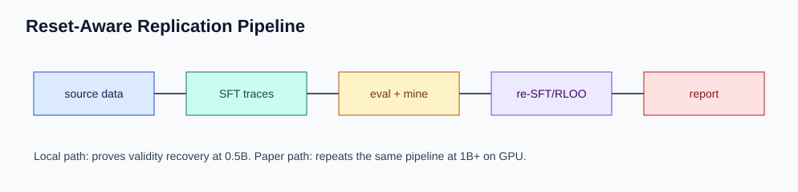
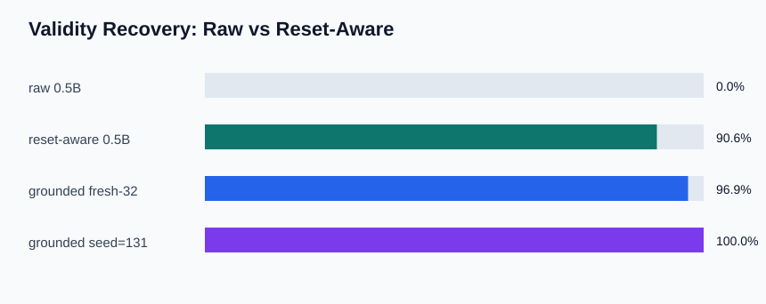

# Learning to Reset

[](https://github.com/shrijacked/learning-to-reset/actions/workflows/ci.yml)

Learning to Reset is a self-contained replication workbench for the paper's core idea: let a reasoning model emit `<clean>`, discard a failing scratchpad, and retry from a clean context. The local 0.5B pilot now demonstrates the real mechanism: reset-aware retry recovers answer validity on hard Countdown prompts. The paper's 36.94% hard-Countdown result is still a separate 1B+ GPU replication target.





## Results

| Setup | Validity | Hard correct | Notes |
|---|---:|---:|---|
| raw 0.5B | 0/32 | 0/32 | no useful answer format |
| reset-aware 0.5B | 29/32 | 1/32 | local pilot ceiling |
| grounded local follow-up | 31/32 to 32/32 | 0/32 | better format, not better arithmetic |
| paper 1B reported | not reported here | 36.94% | paper Section 4.3 |
| our 1B replication | pending | pending | see Phase 3 in `docs/paper-replication.md` |

The honest read: at 0.5B, reset logic fixes malformed outputs far more reliably than it fixes arithmetic. The model often writes valid-looking equations that the verifier computes as the wrong value. That is why the next correctness milestone is either stronger arithmetic supervision or the paper-faithful 1B+ run, not another prompt-template pass.

## Try It

Run the unit suite:

```bash
make test
```

Run the text demo:

```bash
make demo
```

Regenerate the README figures:

```bash
make figures
```

Open the notebook demo:

```bash
jupyter notebook notebooks/demo.ipynb
```

The notebook reads local artifacts when present and falls back to the documented pilot metrics when they are absent.

## Reproduce The Pipeline

Smoke-check the paper pipeline locally without downloading models or spending GPU time:

```bash
make replicate-pilot
```

Run the paper-faithful path only after choosing GPU hardware:

```bash
make replicate-paper BASE_MODEL=Qwen/Qwen2.5-1.5B-Instruct OUT_DIR=runs/replicate-paper
```

That command launches the same orchestration path documented in [docs/paper-replication.md](docs/paper-replication.md). CPU/MPS is useful for tests and pilot artifacts, but it is not a faithful way to chase the 36.94% paper number.

## What Is Implemented

- `<clean>`-aware trace curation for SFT examples
- one-shot reset evaluation and multi-clean retry evaluation
- Countdown sample loading, prompt building, solving, and verification
- failure-mined solver-verified recovery traces
- SFT and reset-aware RLOO runtimes
- provenance reporting for prepared SFT mixes
- full-reset, selective-retention, and memory-aware extension controllers
- figure and qualitative-export scripts for paper-style reporting
- dry-run validation for the full paper replication shell pipeline

## Key Commands

Prepare paper-aligned artifacts:

```bash
PYTHONPATH=src python3 -m learning_to_reset.prepare_paper_artifacts \
  --traces tmp/paper-assets/reference-traces.jsonl \
  --countdown-train tmp/paper-assets/countdown-train.jsonl \
  --countdown-eval tmp/paper-assets/countdown-eval.jsonl \
  --output-dir tmp/paper-artifacts \
  --include-recovery-examples \
  --require-recovery-target-correct
```

Run reset-aware evaluation:

```bash
PYTHONPATH=src python3 -m learning_to_reset.eval_runtime \
  --prepared-countdown tmp/paper-artifacts/countdown-test-hard.jsonl \
  --model tmp/paper-runs/sft-grounded-26apr-seed219mine \
  --output-dir tmp/paper-eval/local-hard-multiclean3 \
  --max-new-tokens 384 \
  --max-clean-tries 3
```

Mine failed eval outputs into verified recovery traces:

```bash
PYTHONPATH=src python3 -m learning_to_reset.failure_recovery_traces \
  --prepared-countdown tmp/paper-artifacts/countdown-test-hard.jsonl \
  --eval-results tmp/paper-eval/local-hard-multiclean3/results.jsonl \
  --output-path tmp/paper-assets/mined-recoveries.jsonl \
  --recovery-style grounded
```

Compare extension controllers on existing multi-clean segments:

```bash
PYTHONPATH=src python3 scripts/run_extension_comparison.py \
  --prepared-countdown tmp/paper-artifacts/countdown-test-hard.jsonl \
  --results-jsonl tmp/paper-eval/local-hard-multiclean3/results.jsonl \
  --output-dir tmp/paper-eval/extensions \
  --max-cleans 3
```

## Documentation

- [docs/completion-plan.md](docs/completion-plan.md): current Phase 1-4 execution plan
- [docs/paper-replication.md](docs/paper-replication.md): GPU runbook for the 1B+ replication
- [docs/grounded-recovery-results-2026-04-26.md](docs/grounded-recovery-results-2026-04-26.md): negative result explaining the 0.5B arithmetic ceiling
- [docs/paper-claims-traceability.md](docs/paper-claims-traceability.md): paper claim to implementation/test map
- [docs/status-report.md](docs/status-report.md): detailed project status and prior experiment log
- [docs/diagrams/end-to-end-pipeline.html](docs/diagrams/end-to-end-pipeline.html): full architecture diagram

## Project Layout

```text
src/learning_to_reset/
  trace_curation.py              SFT trace normalization and clean supervision
  context_manager.py             one-shot clean retry mechanics
  countdown_verifier.py          expression legality and target checking
  failure_recovery_traces.py     mined recovery trace generation
  paper_dataset_prep.py          paper-aligned artifact export and provenance
  eval_runtime.py                raw, reset-aware, and multi-clean evaluation
  rloo_runtime.py                reset-aware RL runtime
  extension_comparison_runner.py extension controller scoring

scripts/
  replicate_paper.sh             end-to-end paper pipeline
  build_figures.py               README/docs SVG figure generator
  run_extension_comparison.py    extension comparison CLI wrapper

tests/
  test_integration_pipeline.py   CPU-tiny full-loop regression test
```

## Limitations

The local run is not a paper-faithful reproduction of the 36.94% number. It is a validated pilot that proves the reset mechanism and documents the arithmetic failure mode. A real reproduction needs the Phase 3 GPU run, fresh run metadata, and updated results in the README before claiming the headline paper result.
