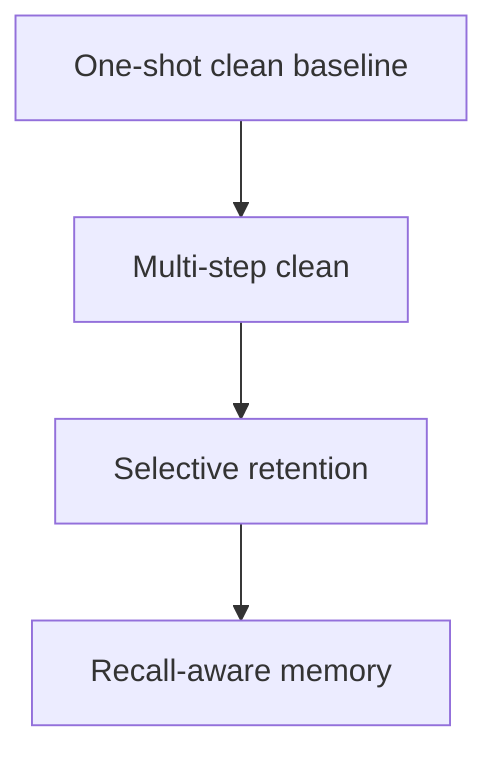

# Extension Roadmap

## Why Extensions Matter More

Even a simple one-shot `<clean>` mechanism can improve reasoning. The more important research opportunity is to turn that proof-of-concept into a stronger context-management system that can reset, preserve, and recall information selectively.

## Priority Order

### Phase 1: Baseline stabilization

- Reproduce trace curation
- Reproduce one-shot cleaning
- Reproduce modified RLOO reward propagation
- Build evaluation hooks around Countdown-style tasks

### Phase 2: Multi-step cleaning

Goal:
- Allow more than one reset in a reasoning episode without creating infinite loops

Current status:
- A first bounded multi-clean controller now exists locally with:
  - a reset budget `k`
  - repeated retry handling
  - a small per-clean penalty for trajectory scoring
- A selective-retention controller now exists locally with:
  - explicit `<retain>...</retain>` notes
  - retry prompts that carry only retained notes, not the full previous scratchpad
  - the same clean-step penalty accounting as bounded multi-clean
- A recall-aware memory module now exists locally with:
  - explicit `<memory>...</memory>` writes
  - deterministic token-overlap recall
  - prompt augmentation for recalled entries

Core changes:
- Add a reset budget `k > 1`
- Add a small step-cost penalty for each clean action
- Record per-step interaction history for analysis

Main risk:
- The model may learn to clean too aggressively instead of persisting through recoverable reasoning

### Phase 3: Selective retention

Goal:
- Preserve useful partial progress when resetting

Current status:
- Explicit retained-note extraction and retry-prompt injection are implemented.
- Retention is opt-in and tag-based, so ordinary full-reset behavior remains unchanged.

Core changes:
- Replace full deletion with span-level keep/drop decisions
- Summarize or cache useful intermediate facts before reset
- Compare full-reset versus partial-retention performance on harder questions

Main risk:
- The retained snippets may keep the same clutter that cleaning was supposed to remove

### Phase 4: Recall-aware memory

Goal:
- Move from a one-token reset mechanism toward a finite context machine with simple memory operations

Current status:
- A lightweight memory store exists for explicit writes and deterministic recall.
- Recall prompt construction is implemented separately from the baseline clean path.

Core changes:
- Introduce explicit write and recall actions
- Store reset reasoning in a lightweight external memory
- Let the policy retrieve selectively during later reasoning stages

Main risk:
- Improved performance might come from memory augmentation rather than better self-management, so evaluation must isolate those effects

## Proposed Evaluation Ladder

## Success Criteria

- The baseline matches the intended qualitative behavior and core reward logic.
- Extensions improve hard-example performance without collapsing into excessive resets.
- The agent becomes more selective over time, not merely more active.
- The extension code path is in place; the next extension milestone is comparative train/eval across full reset, selective retention, and recall-aware memory.
