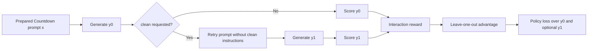

# Method Overview

## Reference Materials

- `main.pdf`
- `rl_proposal.pdf`

## Current Implementation Targets

### 1. SFT Trace Curation

Reference:
- Section 3.2.1
- Figure 3

Current requirement:
- Normalize expert traces into a single `<think>` block plus the final `<answer>` block.
- Remove content outside tagged sections.
- Keep correct traces in the standard `<think> ... </think><answer> ... </answer>` format.
- Convert incorrect or unproductive traces into a recovery example by:
  - appending a short realization that the search is becoming confusing
  - replacing the final answer with a `<clean>` token

### 2. One-Shot Context Manager

Reference:
- Section 3.2.2
- Figure 4

Current requirement:
- Generate an initial response `y0`.
- If `y0` contains `<clean>`, clear the previous reasoning trace and issue a fresh prompt without the cleaning instructions.
- Generate a second response `y1`.
- Stop on the first usable `<answer>` from either `y0` or `y1`.
- Allow at most one clean per interaction in the baseline.

### 3. Modified RLOO Formulation

Reference:
- Section 3.2.3
- Equations 4, 5, and 6

Current requirement:
- Reward the final chosen solution:
  - `R(x, y1)` when a clean-triggered retry exists
  - otherwise `R(x, y0)`
- Compute leave-one-out advantages on interaction-level rewards.
- Backpropagate the same advantage through:
  - `y0` for learning whether to clean
  - `y1` for learning how to answer after cleaning
- Normalize by `k + kc`, where `kc` is the number of cleaned trajectories in the batch.
- Track formatting-plus-correctness for reporting, while allowing the policy update to use correctness-only reward as described in Section 4.1.

### 4. Baseline Runtime Loop

Reference:
- Section 3.2.2
- Section 3.2.3
- Section 4.1

Implemented shape:

Runtime notes:
- Clean-aware evaluation should use the retry path by default.
- The baseline still allows at most one clean per interaction.
- Local metrics should track score, accuracy, clean rate, and checkpoint outputs per run.
### 5. Experimental Anchor

Reference:
- Section 4

Current target:
- Qwen-2.5 0.5B
- Countdown dataset
- SFT followed by RLOO
- Separate attention to hard problems involving multiplication/division

## Extension Priorities

The highest-value next steps go beyond one-shot cleaning. The strongest directions are:

1. Multi-step cleaning with a bounded retry budget and step-cost penalties.
2. Selective memory retention so useful partial progress is not lost on reset.
3. Recall-style memory operations that turn the current finite context machine into a richer context-management agent.

## Working Guardrails

- Use `main.pdf` when behavior is ambiguous.
- Use `rl_proposal.pdf` to inform sequencing and extension priority.
- Every code path should map back to one of the reference sections above or to an explicit extension item.
