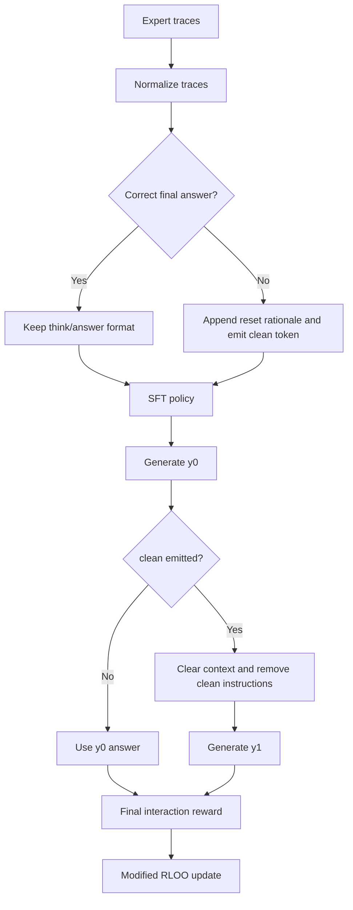
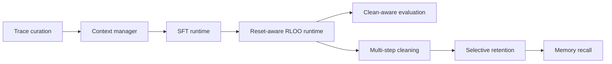

# Project Plan

## Objective

Build the current baseline cleanly, then grow the repository toward higher-value extensions that preserve useful context instead of always deleting everything.

## Architecture

## Dependency Graph

## Traceable Task List

| Task ID | Task | Source | Deliverable | Verification |
| --- | --- | --- | --- | --- |
| R1 | Normalize and curate SFT traces | `main.pdf` Section 3.2.1, Figure 3 | `trace_curation.py` | `tests/test_trace_curation.py` |
| R2 | Implement one-shot clean context manager | `main.pdf` Section 3.2.2, Figure 4 | `context_manager.py` | `tests/test_context_manager.py` |
| R3 | Encode modified RLOO math | `main.pdf` Section 3.2.3, Eq. 4-6 | `rloo.py` | `tests/test_rloo.py` |
| R4 | Add prepared-artifact SFT runtime | `main.pdf` Section 3.2.1, Section 4.1 | `sft_runtime.py` | `tests/test_sft_runtime.py` |
| R5 | Add clean-aware evaluation runtime | `main.pdf` Section 3.2.2, Section 4 | `eval_runtime.py` | `tests/test_eval_runtime.py` |
| R6 | Add reset-aware RLOO runtime | `main.pdf` Section 3.2.3, Section 4.1 | `rloo_runtime.py` | `tests/test_rloo_runtime.py`, tiny-model smoke run |
| R7 | Keep the repo aligned for later sessions | User request + current workflow | repo-local skill | skill file review |
| R8 | Add continuous verification for GitHub | repository bootstrap requirement | GitHub Actions workflow | CI run in GitHub |
| R9 | Compare raw and reset-aware evaluation outputs | `main.pdf` Section 4 | `compare_eval_results.py` | `tests/test_compare_eval_results.py` |
| R10 | Add contrastive recovery trace generation | `main.pdf` Section 3.2.1, Section 4 | `synthetic_countdown_traces.py` | `tests/test_synthetic_countdown_traces.py` |
| R11 | Gate trace-source ablations by held-out Countdown correctness | `main.pdf` Section 4 | local run artifacts | reset-aware and raw eval summaries |
| R12 | Filter retry-stage recovery examples by verifier correctness | `main.pdf` Section 4 | `pipeline.py`, `prepare_paper_artifacts.py` | `tests/test_pipeline.py`, `tests/test_paper_dataset_prep.py` |
| R13 | Export a deterministic hard Countdown eval slice | `main.pdf` Section 4.3.1 | `countdown_slices.py`, `paper_dataset_prep.py` | `tests/test_countdown_slices.py`, `tests/test_paper_dataset_prep.py` |
| R14 | Generate hard-focused Countdown source prompts | `main.pdf` Section 4.3.1 | `synthetic_countdown_dataset.py` | `tests/test_synthetic_countdown_dataset.py` |
| R15 | Mine failed hard evals into verified recovery traces | `main.pdf` Section 3.2.2, Section 4.3.1 | `failure_recovery_traces.py` | `tests/test_failure_recovery_traces.py` |
| E1 | Add multi-step cleaning | `main.pdf` Discussion, `rl_proposal.pdf` Section 2.2 | `multi_clean_extension.py` | `tests/test_multi_clean_extension.py` |
| E2 | Add selective retention after clean | `main.pdf` Discussion, Section 2.3 | `multi_clean_extension.py` | `tests/test_multi_clean_extension.py` |
| E3 | Add recall and memory-aware context management | `main.pdf` Figure 1 and Conclusion | `memory_extension.py` | `tests/test_memory_extension.py` |
| E4 | Compare extension controller trajectories | Extension evaluation plan | `extension_comparison.py` | `tests/test_extension_comparison.py` |

## Current Boundary

### Baseline

- Single-use cleaning only
- No external memory writes or reads
- Final reward assigned to the end-to-end interaction
- Prepared-artifact SFT, reset-aware RLOO, and clean-aware evaluation runtimes exist locally
- Real-source/local-hybrid SFT, reset-aware RLOO, and raw-vs-reset-aware comparison have run on a CPU pilot
- Raw-vs-reset-aware comparison can now be regenerated from evaluation output directories
- Verifier-grounded recovery ablations have run, but they currently tie rather than beat the best expanded SFT result
- Contrastive/all recovery ablation has run, but it regresses below the best expanded SFT result
- Retry-stage recovery examples can now be filtered by verifier correctness before SFT artifact export
- Paper-aligned artifact preparation now emits `countdown-test-hard.jsonl` for multiplication/division-heavy evaluation
- Hard-focused synthetic Countdown source generation can now create multiplication/division-heavy training prompts
- Hard-focused SFT and reset-aware RLOO have both run locally, but neither produced target-correct answers on the held-out hard slice
- Failed hard evals can now be mined into solver-verified recovery traces for the next training cycle
- Remaining baseline work is stronger arithmetic grounding, larger target-model execution, and broader experiment comparison

### Extension

- Bounded multi-clean support exists with a clean budget and per-clean penalty
- Selective retention support exists through explicit `<retain>...</retain>` notes carried into retry prompts
- Reward shaping that penalizes excessive resets
- Selective deletion or summarization instead of full deletion
- External memory recall exists through explicit `<memory>...</memory>` writes and deterministic token-overlap retrieval
- Extension controller comparisons can be rendered as JSON and Markdown artifacts

## Verification Rule

Every implementation step should satisfy one of the following:

- It implements a mechanism described in the reference materials.
- It supports a clearly labeled extension motivated by the reference materials.
- It is required for repository operation, testing, or GitHub automation.
