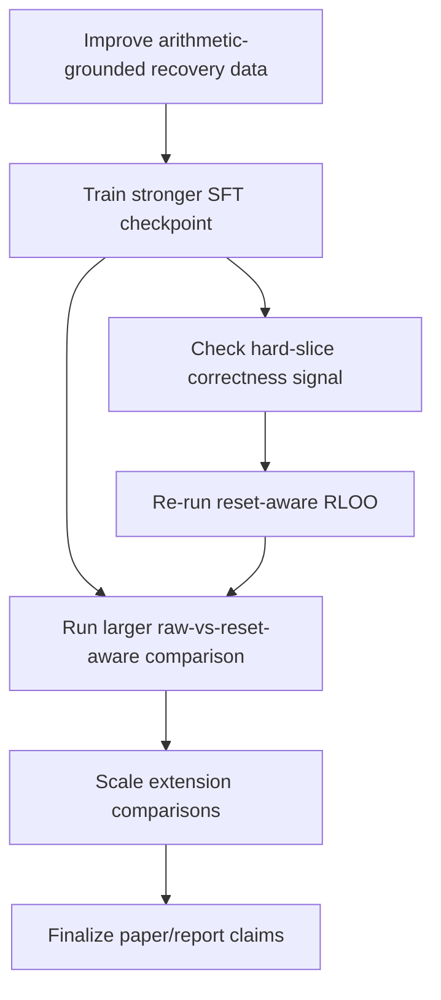

# Repository Audit - 25 April 2026

This document is an honest audit of the repository as it exists on 25 April 2026. It is based on the checked-in code, the current docs, the git history, the package metadata, the CI setup, and the local test suite. The goal here is not to restate the pitch of the project. The goal is to say, clearly, what is already real, what is only partially real, and what still has to happen before this repo feels complete as a research artifact.

## Bottom line

The good news is that this repository is no longer a proposal or a sketch. It has a real implementation of the baseline idea, runnable training and evaluation entrypoints, synthetic and paper-aligned data preparation, a deterministic arithmetic verifier, and a first extension track beyond one-shot cleaning. The repo also has meaningful test coverage, and the full local suite currently passes `123/123` tests.

The more important truth is that the main problem has moved. The project is no longer blocked by missing infrastructure. It is blocked by weak arithmetic correctness. The system has become much better at producing well-formed post-clean answers than at producing truly correct hard Countdown solutions. That is the central remaining research problem in this codebase.

## Current repo state at a glance

| Area | Status | Notes |
| --- | --- | --- |
| Baseline clean mechanism | Implemented and tested | Trace curation, one-shot clean handling, and modified RLOO math are all in code. |
| Data and artifact prep | Implemented | Trace/countdown loaders, prompt building, split/export logic, and paper-aligned prep exist. |
| Training and evaluation runtimes | Implemented | SFT, reset-aware evaluation, and reset-aware RLOO entrypoints are present. |
| Arithmetic verification | Implemented | Countdown solver and verifier are in place and used by multiple pipelines. |
| Recovery-data generation | Implemented | Synthetic, verifier-grounded, contrastive, and failure-mined recovery traces exist. |
| Hard-slice analysis | Implemented | Deterministic multiplication/division-heavy slices can be generated and scored. |
| Extension mechanisms | Implemented, not yet scaled | Multi-clean, selective retention, memory-aware recall, and comparison tooling exist. |
| Reproducibility from scratch | Partial | The building blocks exist, but full best-run reproduction is still manual and multi-step. |
| Paper-strength evidence | Partial | Pilot evidence exists, but the strongest claim in the repo is still about validity, not correctness. |

## What is already done

### 1. The baseline idea is real in code

The original idea of teaching a model to emit `<clean>` and restart its reasoning is no longer theoretical here. The repo has a real trace-curation layer, a real context manager, and a real modified RLOO implementation. Those pieces live in `trace_curation.py`, `context_manager.py`, and `rloo.py`, and they are backed by dedicated tests. There is also a small deterministic demo through `python -m learning_to_reset`, which is useful for explaining the mechanism without needing to launch a training run.

### 2. The repo can prepare actual training and evaluation artifacts

The project has moved beyond hand-wavy "future pipeline" language. There are concrete loaders for trace and Countdown data, prompt builders, split utilities, JSONL exporters, and paper-aligned artifact-prep entrypoints. The data layer is not just a folder of helper functions anymore; it is a proper bridge between raw records and trainer-ready inputs.

That matters because it means the repo now supports the full path from raw source records to prepared SFT data and prepared Countdown evaluation prompts. The structure is there. The naming is consistent. The tests cover the transformation logic. This is real engineering progress.

### 3. The repo can run local training and local evaluation

There are local entrypoints for supervised fine-tuning, reset-aware evaluation, and reset-aware RLOO. This is one of the biggest signs that the repo is no longer in the "scaffold only" phase. The training stack is still lightweight and pilot-oriented, but it exists. The evaluation logic also records the verifier-computed expression value, which is exactly the kind of diagnostic detail you want once a project stops failing at formatting and starts failing at actual arithmetic.

### 4. The project has a serious arithmetic tooling layer

This is one of the strongest parts of the repo. The project includes:

- a deterministic Countdown verifier
- a deterministic Countdown solver
- hard-slice extraction for multiplication/division-heavy samples
- synthetic hard-sample generation
- recovery-trace generation in multiple styles
- failure mining from hard-eval outputs into solver-verified recovery traces

This layer is important because it gives the project a way to generate more targeted supervision instead of blindly scaling generic reset examples.

### 5. The extension path is already more than an idea

The extension story is not just written in the report. There is code for bounded multi-clean control, explicit selective retention via `<retain>...</retain>`, and memory-aware retries via `<memory>...</memory>` plus deterministic recall. There is also a comparison utility that can score full reset, selective retention, and memory-aware trajectories side by side.

That is a strong repo-level accomplishment. Many projects talk about extensions. This one actually implemented them.

### 6. Repo health is decent for a research scaffold

The repo is in reasonably healthy shape for this stage:

- packaging exists through `pyproject.toml`
- CI runs on GitHub Actions for Python 3.9 and 3.11
- the current local unit-test suite passes `123/123`
- the codebase has clear module boundaries
- the docs are better than average for a student research repo

In other words, the repo does not feel fragile in the way many research repos do.

## What is only partially done

This is the part that matters most for planning.

### 1. The pipeline works, but only at pilot scale

The code can fetch data, prepare artifacts, train, evaluate, compare runs, and generate recovery data. That is done. But the strongest checked-in evidence is still from local pilot-scale runs on small held-out slices and a fresh 32-example hard holdout. This is enough to show the mechanism works. It is not yet enough to claim that the method is mature or decisively strong.

### 2. Reset behavior is stronger than arithmetic behavior

This repo has largely solved the "can the system use `<clean>`?" question. It has not solved the "can the system become reliably correct on hard arithmetic after cleaning?" question. The current best signal is still heavily skewed toward improved validity and well-formed retries, with only small gains in actual target-correct answers.

That means the core scientific bottleneck is no longer control flow. It is arithmetic grounding.

### 3. RLOO infrastructure exists, but the learning signal is still weak

Reset-aware RLOO is implemented and can run. That is important. But the current docs make it clear that RLOO has not yet produced a convincing gain over the best SFT checkpoint on the held-out hard cases. In the hard-focused run, the loss staying at zero is especially revealing: the policy did not see enough correctness variation to learn anything useful.

So RL is not blocked by missing code. It is blocked by weak upstream supervision and weak reward-bearing samples.

### 4. Extensions exist, but they are not yet experimentally established

The multi-clean, selective-retention, and memory-aware controllers are implemented. What is still missing is the scaled train/eval evidence that tells us whether these extensions actually beat the simpler one-shot reset baseline. Right now the repo contains extension mechanisms and extension comparison utilities, but not the final comparative experimental story.

### 5. Reproducibility is better than before, but still not "clone and run one command"

The repo exposes the pieces needed to reproduce the workflow, but it still feels like a research workbench rather than a fully self-contained benchmark artifact. The strongest runs are described across README instructions and status docs, not captured as a single versioned orchestration command or checked-in run manifest.

That is normal for this stage, but it is still unfinished work.

## What is left

This is the part I would treat as the actual remaining backlog.

### A. Fix the main blocker: arithmetic-grounded recovery supervision

This is the single most important unfinished item in the whole repo.

Right now, the model often produces recovery responses that sound verified without actually being correct. The verifier catches this, and the status docs already call it out clearly. Until that failure mode is improved, the repo will keep showing the same pattern: strong validity after reset, weak correctness on hard problems.

What is left here:

- strengthen recovery traces so they teach actual arithmetic checking rather than just the language of checking
- filter or regenerate low-quality retry examples more aggressively
- ensure the next SFT round is trained on traces where the "verified" form corresponds to genuinely target-correct arithmetic

Why this comes first:

- it directly attacks the current bottleneck
- it increases the chance that RL will see a non-degenerate reward signal
- it improves both the baseline path and every later extension

### B. Add or obtain a stronger expert-trace source

The repo has paper-aligned adapters and fallback synthetic supervision, which is useful. But the docs are blunt that a stronger Countdown-native expert-trace source is still missing. That gap matters because synthetic fallback traces can carry the project only so far.

What is left here:

- obtain a cleaner source of productive and unproductive expert traces
- make sure hard recoveries are target-correct and not merely well-phrased
- feed that stronger source into the prepared-artifact pipeline without contaminating evaluation

Why this matters:

- better source data is more likely to improve correctness than simply increasing the volume of reset-style traces
- the recent ablations already suggest that more recovery-style data alone is not enough

### C. Retrain the baseline in the right order

The dependency order from here is important.

The repo is now at the point where sequencing matters more than invention. The next move should not be "add more mechanisms." It should be:

1. improve the recovery data
2. retrain SFT
3. verify that correctness, not just validity, improves on hard prompts
4. only then rerun RLOO

If RLOO is rerun before SFT produces more correct hard retries, the project is likely to repeat the same low-signal outcome.

### D. Run a broader hard-slice comparison

The current hard-slice story is useful, but still small. There is an original 3-example hard slice and a fresh 32-example hard holdout. Those are helpful checkpoints, not final evidence.

What is left here:

- score a broader hard Countdown slice with raw one-pass decoding
- score the same slice with reset-aware retry
- compare expanded SFT, verifier-grounded SFT, plus-mined SFT, and any later RL checkpoints on the same evaluation protocol
- preserve fresh held-out data whenever mined failures are fed back into supervision

This work matters because the repo already contains the comparison utilities. What is missing is the scaled experiment execution.

### E. Actually evaluate the extensions, not just the baseline

The extension modules are in place, which is great. But as a repo-level story, they are still "implemented extensions" rather than "validated improvements."

What is left here:

- run full reset vs selective retention vs memory-aware clean-loop comparisons on a meaningful hard slice
- measure not just score and correctness, but also clean frequency and reset efficiency
- confirm that memory or retention improves performance because of better context management, not because it smuggles in extra information in an uncontrolled way

This is the difference between having extension code and having extension results.

### F. Tighten the repo as a reproducible artifact

This is not the most urgent research task, but it is still unfinished repo work.

The package metadata is intentionally minimal. `pyproject.toml` does not declare the full training stack; the README currently asks the user to install `transformers`, `datasets`, `accelerate`, and `torch` manually. That is acceptable for a local research scaffold, but it is not the final form of a reproducible repo.

What is left here:

- decide whether to add proper runtime dependencies or optional extras for the trainer stack
- capture best-known runs in explicit manifests, scripts, or checked-in configs
- make it easier for another person to reproduce the strongest local baseline without piecing together commands from several docs
- consider whether a small integration smoke test for the trainer/evaluator path should exist outside pure unit tests

If the goal is only class delivery, this is secondary. If the goal is a durable public research artifact, this becomes important.

### G. Align the paper/report claims with the checked-in evidence

This is one of the most important non-code audit findings.

The repo docs are fairly honest: they describe a working baseline, pilot-scale experiments, strong validity improvements, and weak hard-problem correctness. If the checked-in paper assets are meant to describe the same current state, then they need to stay aligned with that evidence. Otherwise the repo ends up telling two different stories: a careful engineering story in `docs/`, and a stronger results story in the paper assets.

What is left here:

- decide what the authoritative current story is
- make sure reported numbers reflect the runs the team is actually prepared to stand behind
- distinguish clearly between implemented mechanisms, pilot results, and final-report claims

This is less glamorous than a new model run, but it matters a lot for credibility.

## Recommended order of completion

If I were planning the next work block, I would do it in this order:

| Priority | Task | Why now |
| --- | --- | --- |
| 1 | Improve arithmetic-grounded recovery supervision | This is the main blocker behind the current weak correctness signal. |
| 2 | Train the next SFT checkpoint on improved recovery data | SFT needs to become stronger before RL has a useful reward landscape. |
| 3 | Re-evaluate on a fresh hard holdout | This tells you whether the real bottleneck moved. |
| 4 | Re-run reset-aware RLOO | Only worth doing once hard retries are occasionally correct. |
| 5 | Run larger raw-vs-reset-aware hard-slice comparisons | This turns the baseline story into stronger evidence. |
| 6 | Scale extension comparisons | Extensions should be judged only after the baseline is arithmetically stronger. |
| 7 | Improve reproducibility and align the paper/report | This makes the repo durable and easier to defend externally. |

## Honest assessment

This repo is in a better state than many research repos at the same stage. The code is organized. The tests pass. The docs are unusually clear. The baseline mechanism, data preparation, training loop, verifier, and extension ideas are all present in code.

What is still missing is not another round of scaffolding. What is missing is stronger evidence. The project now needs fewer new components and more disciplined execution against the real blocker: hard arithmetic correctness after reset. Once that improves, the rest of the story becomes much easier to finish cleanly.
