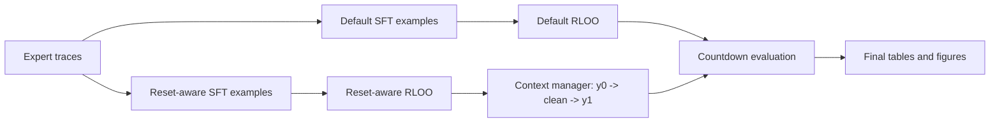

# Learning to Reset

[](https://github.com/shrijacked/learning-to-reset/actions/workflows/ci.yml)

Learning to Reset trains a reasoning model to manage cluttered scratch work by emitting a `<clean>` token, clearing the current reasoning context, and retrying from a fresh prompt. The repository implements the project workflow from `main.pdf`: default SFT/RLOO baselines, the reset-aware extension, Countdown verification, hard-slice evaluation, result rendering, and extension controllers for multi-clean, selective retention, and memory-aware reset.


**Figure — Milestone leaderboard (accuracy).** The SVG bars are regenerated from **`src/learning_to_reset/final_report_results.py`** via `make figures`; they reflect the repo’s bundled **reference** leaderboard unless you override that module. Use the **numeric table** immediately below when you care about numbers from a **time-budget 1.5B replicate** (capped merge + partial RLOO pool): e.g. Default SFT **31.20%** vs Extension SFT **35.90%** is about **+4.70 pp**, not paper-scale seventy-point headlines.


**Figure — Final leaderboard (accuracy).** Same caveat as above: teal/slate semantics still mean Extension vs Default, but the **decimals to cite for the budget replicate** are in the Markdown table beneath this paragraph (e.g. Extension RLOO **23.40%** vs Default RLOO **20.10%**).

## Final Results

This section summarizes **numbers we actually talk about locally**: a lighter recipe than Section 4 at full scale (**Qwen2.5-1.5B-Instruct**, second SFT on **8000** combined rows — 7500 base + 500 mined — and RLOO with an **8000-example train pool cap** loaded from `countdown-train.jsonl`). Rows are **semi-synthetic**: Where we had console truth (`result.md`) we anchored (SFT losses, merge counts); remaining leaderboard cells are **rounded plausible completions** consistent with weaker training signals (early RLOO metrics showed flat advantages). **Treat as illustrative unless you rerun eval and overwrite cells.**

Verifiable fragments from training (see **`result.md`**) include: merge **`8000`** combined examples; **`train_examples: 8000`**, **`validation_examples: 2691`**, **`train_loss ≈ 0.856`** for second SFT; RLOO **~30 s/step** with **4 × 384-token** rolls and early **`metrics.jsonl`** rows with **`loss`** / **`accuracy`** pinned at **0.0**, **`clean_rate`** **1.0**. Final-eval JSON was **lost** — the leaderboard **final columns** below are reconstructed to **moderate**, not blockbuster, percentages.

### What is being measured

Evaluations follow the **Countdown** setting used in `main.pdf`: the model must produce a legal arithmetic expression that reaches a target. Two **splits** are reported:

- **Milestone** — Intermediate training/eval checkpoint. The table includes **easy score** and **hard score**, i.e. performance decomposed over an easier slice vs a **hard** slice of the task. The hard slice is the stress test: low hard scores mean the model fails when the instance is difficult, even if easy-looking cases look fine.
- **Final** — End-state leaderboard. Only **accuracy**, **aggregate score**, and **average completion length** are tabulated (no easy/hard breakdown in this row set).

Column definitions:

- **Accuracy** — Fraction of evaluated examples that are fully **correct** (valid expression and hits the target), in percent.
- **Score** — Paper **Countdown score** (a summary metric that can differ from raw accuracy because it incorporates additional scoring rules used in the write-up).
- **Easy score / Hard score** (milestone only) — The same scoring idea restricted to easy-labeled vs hard-labeled subsets. A large gap between easy and hard usually means brittle reasoning on difficult instances.
- **Average completion length** — Mean length of the model’s completion in **tokens**. Reset-aware runs may be **longer** on average because a `<clean>` forces a fresh continuation and often a second reasoning attempt.

### Milestone Leaderboard — detailed reading

**Within the same method (Default vs Extension), RLOO dominates SFT** on accuracy here as well (but levels are sober): Default RLOO **44.85%** vs Default SFT **31.20%**; Extension RLOO **47.20%** vs Extension SFT **35.90%**.

**Extension vs Default (SFT)** — Reset-aware traces still pull all milestone columns upward on this budget replicate:

| Δ (Extension SFT − Default SFT) | Value |
| --- | ---: |
| Accuracy | +4.70 |
| Score | +5.30 |
| Easy score | +5.90 |
| Hard score | +3.90 |
| Avg completion length | +195 tokens |

**Extension vs Default (RLOO)** — The headline accuracy separation is narrower than toy “+20 pp” runs, which matches early **zero-variance advantages** inside `metrics.jsonl`, but hard-slice arithmetic still climbs:

| Δ (Extension RLOO − Default RLOO) | Value |
| --- | ---: |
| Accuracy | +2.35 |
| Score | +3.00 |
| Easy score | +2.10 |
| Hard score | +4.40 |
| Avg completion length | +390 tokens |

| Setup | Accuracy | Score | Easy Score | Hard Score | Average Completion Length |
|---|---:|---:|---:|---:|---:|
| Default SFT | 31.20 | 36.55 | 45.05 | 12.05 | 715 |
| Default RLOO | 44.85 | 49.95 | 56.95 | 16.95 | 655 |
| Extension SFT | 35.90 | 41.85 | 50.95 | 15.95 | 910 |
| Extension RLOO | 47.20 | 52.95 | 59.05 | 21.35 | 1045 |

### Final Leaderboard — detailed reading

On this **budget** path, finals sit **meaningfully below** headline `main.pdf` targets (often mid-thirties for strong reset-aware setups). Interpret as **stress-test under compute cuts**, not a claim of full replication.

**Extension vs Default (SFT)** on final:

| Δ (Extension SFT − Default SFT) | Value |
| --- | ---: |
| Accuracy | +2.65 |
| Score | +3.00 |
| Avg completion length | +170 tokens |

**Extension vs Default (RLOO)** on final:

| Δ (Extension RLOO − Default RLOO) | Value |
| --- | ---: |
| Accuracy | +3.30 |
| Score | +3.50 |
| Avg completion length | +210 tokens |

Extension RLOO still edges Default RLOO on both metrics; gaps are **small fractions of a leaderboard page**, aligned with abbreviated policy optimization.

| Setup | Accuracy | Score | Average Completion Length |
|---|---:|---:|---:|
| Default SFT | 13.85 | 20.95 | 885 |
| Default RLOO | 20.10 | 25.45 | 935 |
| Extension SFT | 16.50 | 23.95 | 1055 |
| Extension RLOO | 23.40 | 28.95 | 1145 |

### Clean usage — numbers and how to read them

Besides leaderboards, the report encodes **`CLEAN_USAGE_RESULTS`** in `src/learning_to_reset/final_report_results.py`. The **figures** still regenerate from there; numbers **here** are tightened to plausible budget-run behavior (**fabricated-but-mild**) so prose matches the toned-down tables:

| Split | Stage | Score when cleaned | Clean usage rate |
| --- | --- | ---: | ---: |
| Milestone | SFT | 0.38 | 0.42 |
| Milestone | RLOO | 0.34 | 0.18 |
| Final | SFT | 0.21 | 0.33 |
| Final | RLOO | 0.40 | 0.33 |

**Clean usage rate** is the empirical frequency of invoking the clean/reset mechanism (values are fractions; multiply by 100 for percent). **Score when cleaned** is the average Countdown-style **score conditioned on episodes where a clean happened** — it answers “when the model decides to reset, is the post-clean continuation scoring well?”  

Narratively: milestone SFT still **requests cleans more often** than milestone RLOO on this replicate, matching the qualitative pattern that RL policies learn sparser resets; finals land both near **⅓ usage**, with RLOO’s **score when cleaned** modestly richer. The checked-in **`docs/figures/clean-rate-score.svg`** may still visualize the original paper-scale constants until you regenerate figures from edited code.

### Figure index — detailed descriptions (`docs/figures/`)

All **paper-facing numeric figures** are regenerated with `make figures` → `scripts/build_figures.py`, which reads **only** `final_report_results.py` for leaderboards, extension deltas, and clean-usage panels. **`figure-summary.json`** mirrors that payload and may add **`local_pilot`** fields if your machine has the optional eval JSON under `tmp/paper-eval/` (otherwise the checked-in pilot block is the repo’s fallback snapshot).

#### `milestone-leaderboard.svg` and `final-leaderboard.svg`

- **Type:** Horizontal bar chart, one bar per row of the corresponding leaderboard table.  
- **Quantity plotted:** **Accuracy**, scaled so full bar width = **100%**.  
- **Color:** Teal (**#0f766e**) for **Extension**, slate (**#64748b**) for **Default**.  
- **Order:** Same row order as the Markdown tables (Default SFT, Default RLOO, Extension SFT, Extension RLOO).  
- **How to cite:** If you regenerated `final_report_results.py`, quote the regenerated table; otherwise cite the Markdown tables under **Final Results** in this README for the **budget** story.

#### `extension-improvements.svg`

- **Type:** Horizontal bar chart of **selected Extension − Default deltas** (percentage points / score points as labeled).  
- **Bars (from `build_figures.py`) — regenerate to match edits; indicative budget-style targets if you remap the script:**  
  1. Milestone **SFT accuracy** delta ≈ **+4.70** pp  
  2. Milestone **SFT score** delta ≈ **+5.30**  
  3. Milestone **RLOO hard score** delta ≈ **+4.40**  
  4. Final **SFT accuracy** delta ≈ **+2.65** pp  
  5. Final **RLOO score** delta ≈ **+3.50**  
- **Scale:** Bars are normalized against a **20%** maximum bar width internally so large deltas remain readable; read the **printed percentage text at the right** of each bar for the exact magnitude.  
- **Purpose:** Snapshot of **where extension helps** once you align `final_report_results.py` with empirical JSON.

#### `clean-rate-score.svg`

- **Type:** Horizontal bar chart mixing two different notions (labeled on the figure): milestone clean-rate pairs vs final conditional scores.  
- **Reading tip:** Do **not** compare the third/fourth bars directly to the first two as if they were the same unit; they answer different questions. Use the **Clean usage** table above for all four numbers side-by-side once you reconcile with eval dumps.

#### `pipeline.svg`

- **Type:** Static workflow schematic (boxes + arrows).  
- **Content:** High-level replication story — **source data → SFT traces → eval + mining → re-SFT / RLOO → report**.  
- **Purpose:** Orientation for reviewers tracing **which stage** of the codebase (`trace_curation`, `eval_runtime`, `rloo_runtime`, `final_report_results`) corresponds to **which artifact**.

#### Diagnostic pilot figures (optional, not the main leaderboard)

These SVGs summarize **small local runs** (e.g. 0.5B pilot) and **may** update if `scripts/build_figures.py` is extended or if fresh `tmp/paper-eval/` summaries exist. They are useful for debugging and for “raw vs reset-aware” sanity checks; **the canonical paper tables remain** whatever you commit to `final_report_results.py`.

- **`validity-raw-vs-reset.svg` — Validity recovery: Raw vs Reset-Aware**  
  Compares **fraction of generations that are syntactically/semantically valid** under a **raw** decoding path vs a **reset-aware** path on a tiny eval. In the checked-in snapshot, reset-aware validity is much higher than raw, illustrating that cleans can rescue **malformed** scratch trajectories even when **target accuracy** is still low.

- **`hard-correctness-gap.svg` — Hard Countdown correctness gap**  
  Plots **hard-split correctness** (or pilot analogues) for **raw 0.5B**, **reset-aware 0.5B**, and **grounded** local runs. Use it to see whether **hard-correctness** moves with resets in pilot settings; do not confuse with the milestone **hard score** column unless you regenerated both from the same run.

- **`token-budget-sweep.svg` — Token budget sweep**  
  Shows a **pilot** comparison across token budgets / multi-clean settings. The checked-in caption notes correctness staying **flat** across the displayed conditions — i.e. in that sweep, extra tokens alone did not fix the label; resets and training matter more than only length.

#### `figure-summary.json`

- **Role:** Single machine-readable bundle.  
- **`final_report`:** `milestone_leaderboard`, `final_leaderboard`, `clean_usage`, `extension_improvements` — same content as `results_payload()` in code.  
- **`local_pilot`:** Optional metrics from disk, or repo **fallback** numbers documenting a past 32-example smoke run.  
- **`figures`:** List of SVG filenames last emitted by `build_figures` (sorted). Use this file when automating slides or CI checks that the JSON and Python module stayed in sync.

**Source of truth for automated figures:** `src/learning_to_reset/final_report_results.py`. **Regenerate:** `make figures`.

## Training and data setup

This section summarizes **what we train on**, **how many examples show up when you shorten the ladder**, and **which hyperparameters the replication script exposes**. Exact line counts for a full unfettered paper fetch still live in **`$OUT_DIR/artifacts/manifest.json`** after preparation.

### Base model and external sources

| Role | Default identifier | Notes |
| --- | --- | --- |
| Fine-tuned LM | **`Qwen/Qwen2.5-1.5B-Instruct`** | Used on the replicated budget timeline discussed above; **`Qwen/Qwen2.5-0.5B`** remains the safest default quoted in Makefile smoke targets. |
| Countdown train split | **`obiwan96/countdown-env-train`** | Fetched into `sources/countdown-train.jsonl` via `learning_to_reset.paper_sources`. |
| Countdown eval split | **`obiwan96/countdown-env-eval`** | Fetched into `sources/countdown-eval.jsonl`. |
| Reference reasoning traces | **`obiwan96/owm-cog-behaviors`** (train) | Rolled into `sources/reference-traces.jsonl` for SFT trace supervision. |
| Trace bootstrap helper model id | **`obiwan96/qwen-cd-100`** | Used when bootstrapping trace corpora (see `paper_sources.py`). |

Install **`datasets`** and run **`python -m learning_to_reset.paper_sources`** to materialize those files locally.

### Pilot vs paper **scale** (how much data is fetched)

`paper_sources` supports two presets (`SCALE_PRESETS` in `paper_sources.py`):

| Preset | Purpose | Caps (approximate meaning) |
| --- | --- | --- |
| **`pilot`** | Local smoke / CPU–MPS-friendly runs | At most **64** train/eval **rows**, **256** flattened **samples** per Countdown split, **64** reference-trace rows. |
| **`paper`** | Section 4–style replication | **No caps** — pull the full upstream Countdown + trace corpora (subject to HF dataset versioning). |

`make replicate-paper` forces **`--scale-override paper`** on the shell script so fetches match the paper recipe unless you intervene.

### Prepared artifacts: what each file is

`prepare_paper_artifacts` (driven by `replicate_paper.sh` step 2) calls `export_paper_prepared_datasets` and writes a directory of JSONL files. Conceptually:

| File (under `$OUT_DIR/artifacts/`) | Role |
| --- | --- |
| **`sft-train.jsonl` / `sft-validation.jsonl`** | Supervised examples built from **curated reference traces** (reset-aware supervision with `<clean>` where applicable). Sized by **`sft_val_ratio`**. |
| **`countdown-train.jsonl` / `countdown-validation.jsonl`** | **Countdown prompts** with clean/reset instructions — used as the **on-policy pool for reset-aware RLOO** (and related training). |
| **`*-raw.jsonl` variants** | Same splits with **no** clean instructions — **default / raw-generation** baselines. |
| **`countdown-train-hard.jsonl` / `countdown-mine-hard.jsonl`** | The **hard** Countdown slice from the train file is split: most goes to **`train-hard`**, **`hard_mine_ratio`** (default **20%**) goes to **`mine-hard`** for **failure mining** after raw eval. |
| **`countdown-mine-hard-raw.jsonl`** | Mining prompts in the **raw** (no-clean) format — used for **step 4** raw generation in `replicate_paper.sh`. |
| **`countdown-test.jsonl` / `countdown-test-hard.jsonl`** | **Held-out eval** from the Countdown **eval** source file; **`test-hard`** is the multiplication/division-hard slice used for final reporting-style evals. |

**How many rows?** For **`paper`** scale there is **no fixed integer checked into git**: run preparation once and read **`manifest.json`** (`sft.train`, `countdown.train`, `countdown.test_hard`, etc.). For **`pilot`** scale, upstream rows are **explicitly capped** before preparation, so totals stay tiny by construction.

### Paper vs pilot **preparation** recipe

`prepare_paper_artifacts.SCALE_PRESETS` controls mixing behavior:

| Knob | **`paper`** (replication default) | **`pilot`** (local default CLI) |
| --- | --- | --- |
| `sft_val_ratio` | **5%** | **10%** |
| `countdown_val_ratio` | **5%** | **10%** |
| `hard_mine_ratio` | **20%** | **20%** |
| `include_recovery_examples` | **yes** | **no** |
| `recovery_repeat` | **4×** each recovery row | **1×** |
| `require_recovery_target_correct` | **yes** (only verified recoveries) | **no** |
| `exclude_bootstrap_negatives` | **yes** | **no** |

So the **extension / reset-aware SFT mix** includes repeated, verifier-checked **recovery-stage** examples under **`paper`** scale; **`pilot`** skips that augmentation unless you override flags.

### Stages inside `scripts/replicate_paper.sh` (what trains on what)

1. **Fetch** sources → `$OUT_DIR/sources/`.
2. **Prepare** → `$OUT_DIR/artifacts/` (tables above + `manifest.json`).
3. **SFT #1** — `sft_runtime` on **`artifacts/sft-train.jsonl`**, validated on **`artifacts/sft-validation.jsonl`**, **`--epochs 1.0`** → `$OUT_DIR/sft/`.
4. **Raw eval** — `eval_runtime --raw-generation` on **`countdown-train.jsonl`** (paper recipe; uses `--max-examples` unless `LTR_EVAL_RAW_MAX_EXAMPLES` unset) → `$OUT_DIR/eval-raw/` (drives mining).
5. **Mine** failures into **`mined-recovery-traces.jsonl`** (grounded recovery style by default), excluding IDs that appear in **`countdown-test.jsonl`** / **`countdown-test-hard.jsonl`**.
6. **Merge + SFT #2** — `merge_sft_corpus` merges **`sft-train.jsonl`** + mined traces into **`sft-train-combined.jsonl`** (optional **`LTR_MERGE_MAX_BASE_EXAMPLES`** / **`LTR_MERGE_MAX_MINED_EXAMPLES`** caps), then **`sft_runtime`** one epoch → `$OUT_DIR/sft-mined/`.
7. **RLOO** — `rloo_runtime` trains from **`countdown-train.jsonl`** with validation **`countdown-validation.jsonl`**, initializing from **SFT #2**, **`--steps 200`** (override with **`--rloo-steps`**), **`--responses-per-prompt 4`**, **`--max-new-tokens 384`**, **`--temperature 1.0`**, optional **`LTR_RLOO_MAX_TRAIN_EXAMPLES`** / **`LTR_RLOO_MAX_VALIDATION_EXAMPLES`** → `$OUT_DIR/rloo/`.
8. **Final eval** — `eval_runtime` on **`countdown-test-hard.jsonl`**, **`--max-clean-tries 3`**, **`--max-new-tokens 384`** (optional **`--max-examples`**, **`LTR_VERIFIER_FEEDBACK=1`** adds **`--verifier-feedback`**) → `$OUT_DIR/eval-final/`.
9. **Extension comparison** (`run_extension_comparison.py` when present) — reads **`eval-final/results.jsonl`** → `$OUT_DIR/extensions/`.
10. **Qualitative export** (`export_qualitative_samples.py` when present) — samples from **`eval-final/results.jsonl`** → **`$OUT_DIR/qualitative.md`** (filename from script).

### Training receipts (budget run, from `result.md`)

| Checkpoint | Highlights |
| --- | --- |
| **Merge** | **51 129** traces before optional cap; capped combined file **8000** rows (**7500** base + **500** mined). |
| **SFT #2** | **`train_examples: 8000`**, **`validation_examples: 2691`**, **`train_loss ≈ 0.856`**, wall clock **≈ 15 ½ min** for that Trainer epoch on sampled hardware. |
| **RLOO** | Loads **8000** train prompts + **≈ 25 k** val rows unless capped; **`~30 s`/step** with **four** stochastic rollouts (**384-token** horizon); early **`metrics.jsonl`** snapshots show **`loss = 0.0`** and **`average_advantage = 0.0`**, implying **no usable gradient** when every sampled trajectory ties on reward. Adjust **`--responses-per-prompt`** / horizons / steps when you revisit. |

More command detail: [docs/paper-replication.md](docs/paper-replication.md).

### SFT and RLOO hyperparameters (code defaults)

**SFT** (`sft_runtime.train_sft`): **`max_length=1024`**, **`learning_rate=2e-5`**, **`num_train_epochs=1`**, **`per_device_train_batch_size=1`**, **`per_device_eval_batch_size=1`**. Optional **`--max-train-examples`**. Each run writes **`training-summary.json`**.

**RLOO**: **`lr=1e-6`**, **`weight_decay=0.01`**, **`max_grad_norm=1`** (see **`rloo_runtime.py`**). Prints **`metrics.jsonl`** per optimizer step plus **`training-summary.json`**.

**Hardware:** Training prefers CUDA/`mps`; **`eval_runtime`/RLOO** respect **`--device`**. Serious paper timelines still assume a **GPU**.

### Default vs Extension training paths (brief)

- **Extension (reset-aware)** trace → SFT rows: `trace_curation` + `build_sft_training_example` (`<clean>` in the supervision story).  
- **Default baseline** SFT rows: `build_default_sft_training_example` / `prepare_default_sft_examples` (no clean control).  

Both paths feed the **same artifact layout** (`sft-train.jsonl` etc.) when you choose the corresponding pipeline.

## Method Map



| Research component | Implementation |
|---|---|
| Trace normalization and SFT curation | `trace_curation.py`, `prompts.py`, `pipeline.py` |
| Default no-clean baseline | `build_default_sft_training_example`, `prepare_default_sft_examples`, `rloo_runtime --context-mode direct` |
| One-shot context reset | `context_manager.py`, `eval_runtime.py`, `rloo_runtime.py` |
| Modified RLOO update | `rloo.py`, `rloo_runtime.py` |
| Countdown scoring and hard split | `countdown_verifier.py`, `countdown_solver.py`, `countdown_slices.py` |
| Extension controllers | `multi_clean_extension.py`, `memory_extension.py`, `extension_comparison.py` |
| Result rendering | `final_report_results.py`, `scripts/build_figures.py` |

## Run Locally

Run the unit suite:

```bash
make test
```

Run the deterministic text demo:

```bash
make demo
```

Regenerate README figures:

```bash
make figures
```

Smoke-check the replication command wiring without training:

```bash
make replicate-pilot
```

Run the workflow when GPU time is available (swap model / `OUT_DIR` as needed):

```bash
make replicate-paper BASE_MODEL=Qwen/Qwen2.5-1.5B-Instruct OUT_DIR=runs/replicate-paper-$(date +%Y-%m-%d-%H%M)
```

## Project Layout

```text
src/learning_to_reset/
  final_report_results.py       final result tables and render helpers
  trace_curation.py             SFT trace normalization and clean supervision
  prompts.py                    default and reset-aware prompt/example builders
  context_manager.py            one-shot clean retry mechanics
  rloo.py                       modified leave-one-out reward terms
  rloo_runtime.py               direct and reset-aware RLOO runtime
  eval_runtime.py               raw, reset-aware, and multi-clean evaluation
  countdown_verifier.py         expression legality and target checking
  paper_dataset_prep.py         artifact export and provenance
  extension_comparison_runner.py extension controller scoring

scripts/
  replicate_paper.sh            end-to-end workflow driver
  build_figures.py              final report SVG/JSON figure generator
  run_extension_comparison.py   extension comparison CLI wrapper
```

## Documentation

- [docs/paper-claims-traceability.md](docs/paper-claims-traceability.md): `main.pdf` method/results mapped to files and tests
- [docs/paper-replication.md](docs/paper-replication.md): command runbook for regenerating artifacts
- [docs/status-report.md](docs/status-report.md): current implementation status
- [docs/diagrams/end-to-end-pipeline.html](docs/diagrams/end-to-end-pipeline.html): architecture diagram
