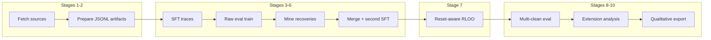

# Reset-Aware Mathematical Reasoning: End-to-End Training & Evaluation Workflow

This document tells the story of **our** pipeline: training a language model to solve **Countdown-style** arithmetic reasoning while learning to **clear derailed scratch work** with a `<clean>` token and a fresh continuation. The narrative moves from raw data → shaped supervision → on-task distilled failures → reinforcement with a reset-aware objective → rigorous evaluation.

The executable spine is **`scripts/replicate_paper.sh`**. It binds ten stages in order; **`scripts/run_budget_pipeline.sh`** is a convenience layer that sets typical **budget** hyperparameters without editing the orchestrator. **§5** lists those defaults and **which stages** each knob binds to.

---

## 1. Problem framing

Large models degrade when intermediate reasoning clutter accumulates—they double-count hypotheses, propagate arithmetic slips, or never commit to a verifier-friendly answer. Rather than patching this only with prompting, **we**:

1. **Supervise** explicit structure (`<think>` … `<answer>`) and optional **context reset** via `<clean>`.
2. **Augment** the curriculum with traces derived from **the model’s own failures** on the target task so optimization stays **task-aligned**.
3. **Reinforce** with **modified RLOO** (REINFORCE leave-one-out), where rewards apply to **full interactions**—initial rollout plus optional post-clean segment—so the policy learns **when** to clean and **how** to recover.

The ten stages exist because each transformation fixes a concrete failure mode: missing data hygiene, naive concatenation of incompatible formats, test-set leakage into mining, or evaluating without the same multi-segment decoding the policy was trained under.

---

## 2. The orchestrator: `scripts/replicate_paper.sh`

**Role.** A single Bash entrypoint that:

- Fixes **`PYTHONPATH`** to the repo’s `src/` so `python -m learning_to_reset.*` is reliable regardless of cwd.
- Parses **CLI flags**: `--base-model`, `--out-dir`, `--scale-override`, `--recovery-style`, `--max-clean-tries`, `--rloo-steps`, optional `--dry-run`.
- Honors **environment variables** for decoding limits, caps on dataset rows, merge sizes, optional step-8-only flags (see **`replicate_paper.sh`** header and **§5**).

**Why Bash here.** Keeps experimentation reproducible: one artifact root (`OUT_DIR`), deterministic relative paths (`sources/`, `artifacts/`, checkpoints, eval logs), no duplicate “forgot step 7” workflows.

---

## 3. Storyline diagram

---

## 4. Stage-by-stage narrative

Below, each block answers: **what runs**, **why it exists**, **where in the orchestrator**, and **what lands on disk**.

### Stage 1 — Ingest upstream sources

**Command.** `python -m learning_to_reset.paper_sources --scale "$SCALE" --output-dir "$OUT_DIR/sources"`

**Why.** We need a single local layout: Countdown-style train/eval streams plus reference behavior traces used to prime `<clean>` semantics. Streaming download avoids bespoke copies of massive corpora across machines.

**Outputs (under `sources/`).** Examples: `countdown-train.jsonl`, `countdown-eval.jsonl`, `reference-traces.jsonl`, plus metadata such as `source-summary.json`.

---

### Stage 2 — Harmonize splits and supervised formats

**Command.** `python -m learning_to_reset.prepare_paper_artifacts` with traces + both Countdown JSONLs → `--output-dir "$OUT_DIR/artifacts"`

**Algorithm / design.** `prepare_paper_artifacts` applies a **scale preset** (`paper` vs `pilot`). For `paper`, that includes stricter validation ratios and **richer** trace-derived SFT augmentation (e.g. recovery-related rows, repeat factors, optional filters that tie recovery to verifier-correct targets—see `SCALE_PRESETS` in `prepare_paper_artifacts.py`).

**Why.** Training and evaluation must share one prompt schema: base instructions, clean instructions, `Question: …`, and metadata (`numbers`, `target`, `source_id`) for the Countdown verifier. This stage also materializes **held-out** test and **hard** slices so later mining cannot claim “we trained on test IDs.”

**Outputs (under `artifacts/`).**  
`sft-train.jsonl`, `sft-validation.jsonl`, `countdown-train.jsonl`, `countdown-validation.jsonl`, `countdown-test.jsonl`, `countdown-test-hard.jsonl`, `manifest.json`.

---

### Stage 3 — First supervised fine-tuning (trace curriculum)

**Command.** `python -m learning_to_reset.sft_runtime` with `--train artifacts/sft-train.jsonl`, `--validation artifacts/sft-validation.jsonl`, `--model "$BASE_MODEL"`, `--output-dir "$OUT_DIR/sft"`, `--epochs 1.0`, optional `--max-train-examples` from `LTR_SFT_MAX_TRAIN_EXAMPLES`.

**Algorithm.** Standard **causal LM cross-entropy** on prompt–response pairs (Hugging Face `Trainer`), with tokenized sequences truncated/padded to the runtime’s `max_length` (default 1024). **Why:** Imitation learning on structured traces is the fastest way to install tags, thinking blocks, and the **syntax** of reset before the model ever sees pure Countdown RL.

**Reference cap.** `10000` train rows — bounds wall time while keeping a dense slice of the trace curriculum.

**Output.** `$OUT_DIR/sft/` (adapter weights + tokenizer sidecars + `training-summary.json`).

---

### Stage 4 — Task-aligned failure collection (raw generation)

**Command.** `python -m learning_to_reset.eval_runtime --raw-generation` on **`artifacts/countdown-train.jsonl`**, model `$OUT_DIR/sft`, `--max-new-tokens` from `LTR_MAX_NEW_TOKENS`, optional `--max-examples` from `LTR_EVAL_RAW_MAX_EXAMPLES`.

**Why not test-hard?** Mining must use **train-distribution** prompts. If we decoded on the hard test file, **source_id** overlap with exclusion lists in stage 5 would trip contamination guards or silently bias supervision.

**Algorithm.** **Greedy (or temperature-0) single-pass** generation: one completion per prompt, scored by the Countdown verifier (see **§7**). **Why:** We want a clean event log of “what the current policy does wrong” before we teach recovery.

**Reference cap.** `750` prompts — trades mining volume for latency; increase if you need more mined rows.

**Output.** `$OUT_DIR/eval-raw/results.jsonl`, `summary.json`.

---

### Stage 5 — Mine failure-conditioned recovery traces

**Command.** `python -m learning_to_reset.failure_recovery_traces` with prepared train prompts, eval results, `--recovery-style` (e.g. `grounded`), and **`--exclude-source-ids`** on both `countdown-test.jsonl` and `countdown-test-hard.jsonl`.

**Why.** Converts “wrong or invalid” generations into **TraceRecord**-shaped supervision: problem, raw model trace, labels—so stage 6 can teach **Countdown-specific** repair patterns instead of only generic behavior traces.

**Output.** `$OUT_DIR/mined-recovery-traces.jsonl`.

---

### Stage 6 — Merge corpora (typed) and second SFT

**Two commands.**

1. `python -m learning_to_reset.merge_sft_corpus` — joins **PromptExample** base rows with **mined** traces only after converting mined JSONL through the same `prepare_sft_examples` path as the rest of the stack. Optional `--max-base-examples` / `--max-mined-examples` implement **compositional caps** (e.g. 10k + 750) without “take first N lines of a concatenated file,” which would erase mined rows.

2. `python -m learning_to_reset.sft_runtime` on `sft-train-combined.jsonl` → `$OUT_DIR/sft-mined`.

**Why.** Naive `cat` of JSONL would **break** loaders: mined and base rows are not the same schema. The merge module is the correctness gate that guarantees a uniform SFT file.

**Algorithm.** Again **cross-entropy SFT**; here the distribution shifts toward **Countdown language** mixed with original trace regularization.

---

### Stage 7 — Reset-aware reinforcement learning (modified RLOO)

**Command.** `python -m learning_to_reset.rloo_runtime` with **Countdown train and validation** artifacts, **`--model` = second SFT dir**, **`--steps`**, **`responses-per-prompt 4`**, **`temperature 1.0`**, **`--max-new-tokens`** aligned with Stages 4 and 8, row caps via `LTR_RLOO_MAX_*`.

**Algorithm (core idea).**

- Sample **\(k\) = 4** independent completions per Countdown prompt.
- Execute the **context manager**: if `<clean>` appears, optionally roll out a **second segment**; define **interaction reward** as correctness on the **final** settled answer (post-clean if cleaning occurred)—see implementations in `rloo.py`, `rollout_runtime.py`, `rloo_runtime.py`.
- **Leave-one-out advantages** (`compute_leave_one_out_advantages`): for each sampled trajectory compare its total reward against the average of the others → lower-variance credit assignment than plain REINFORCE.
- **Modified credit split** assigns gradient mass across initial and retry segments proportional to trajectory structure (clean vs no-clean)—this is where “reset-aware RL” differs from scoring only first segments.

**Why.** SFT binds format; RL optimizes **downstream verifier reward** under stochastic exploration and teaches **when** cleaning helps vs hurts.

---

### Stage 8 — Final evaluation with bounded multi-clean decoding

**Command.** `python -m learning_to_reset.eval_runtime` on **`countdown-test-hard.jsonl`**, model `$OUT_DIR/rloo`, `--max-clean-tries` (= `MAX_CLEAN_TRIES`), same `LTR_MAX_NEW_TOKENS`; optional `--verifier-feedback`.

**Algorithm.**

- Outer loop over prompts with progress logging.
- Inner loop per prompt: generate → **deterministic verifier** parses last `<answer>...</answer>`, builds AST over `+ − × ÷`, checks multiset of **used integers** against allowed numbers, compares **Fraction** value to target (see `countdown_verifier.py`).
- If the model requests `<clean>` and budget remains, **retry** with a trimmed prompt (base instructions + question; clean instructions may be omitted on retries—see `eval_runtime._build_retry_prompt`). Last attempt can ban further `<clean>` tokens via `bad_words_ids` in generation.

**Why.** Headline metrics must reflect the **same** interaction protocol the policy was shaped for—single-pass accuracy would understate a reset-capable system.

**Output.** `$OUT_DIR/eval-final/summary.json`, `results.jsonl` (per-example detail, segments for multi-clean).

---

### Stage 9 — Extension comparison (optional script)

**Command.** `python scripts/run_extension_comparison.py` if present—consumes `eval-final/results.jsonl` and re-scores trajectories under alternative reset controllers (e.g. retention / memory-style policies).

**Why.** Isolates **how much of the gain** comes from the base reset protocol vs stricter extension policies—useful for ablations and figures.

**Output.** `$OUT_DIR/extensions/`.

---

### Stage 10 — Qualitative export (optional script)

**Command.** `python scripts/export_qualitative_samples.py` → `qualitative.md`.

**Why.** Turns dense JSONL into human-readable exemplars for decks and error analysis.

---

## 5. Reference configuration (budget run)

When you invoke **`scripts/run_budget_pipeline.sh`**, it exports the baseline below and runs **`scripts/replicate_paper.sh`** (everything is overridable with `export` before the script).

**Orchestrator CLI:** **`run_budget_pipeline.sh`** exports shell variables then calls **`replicate_paper.sh`** with matching **`--base-model`**, **`--out-dir`**, **`--scale-override`**, **`--rloo-steps`**, **`--max-clean-tries`**, **`--recovery-style`**. (**`OUT_DIR`** and **`--out-dir`** must be the same path.)

| Knob | Value | Role — **required / used in which step(s)** |
|------|-------|--------------------------------------------|
| `OUT_DIR` + **`--out-dir`** | `runs/my-new-budget-run` (default via `run_budget_pipeline.sh`) | **Stages 1–10:** single artifact root for `sources/`, `artifacts/`, `sft/`, `sft-mined/`, `rloo/`, `eval-raw/`, `eval-final/`, `sft-train-combined.jsonl`, `extensions/`, `qualitative.md`, and paths derived in the orchestrator. |
| `BASE_MODEL` + **`--base-model`** | `Qwen/Qwen2.5-1.5B-Instruct` | **Stage 3:** `sft_runtime --model` → writes **`$OUT_DIR/sft/`**. **Stage 6:** second `sft_runtime --model` is **`$BASE_MODEL` again** in **`replicate_paper.sh`** (not **`$SFT_DIR`**), → **`$OUT_DIR/sft-mined/`**. **Stage 4** loads **`$OUT_DIR/sft/`** (stage-3 output). **Stage 7** loads **`$OUT_DIR/sft-mined/`**. **Stage 8** loads **`$OUT_DIR/rloo/`**. |
| `SCALE` / `--scale-override` | `paper` | **Stage 1:** **`paper_sources --scale`** (how much upstream data is pulled). **Stage 2:** **`prepare_paper_artifacts --scale`** (preset for validation ratios and trace-augmentation behavior). |
| `RLOO_STEPS` / `--rloo-steps` | `100` | **Stage 7 only:** number of modified-RLOO optimizer steps (`rloo_runtime --steps`). |
| `MAX_CLEAN_TRIES` / `--max-clean-tries` | `3` | **Stage 8:** upper bound on `<clean>`-then-retry loops per example (`eval_runtime`). **Stage 9:** passed as **`--max-cleans`** to extension comparison when that script compares policies under the same retry budget. |
| `RECOVERY_STYLE` / `--recovery-style` | `grounded` | **Stage 5 only:** how **`failure_recovery_traces`** converts failures into mined **`TraceRecord`** rows (tone and structure of the synthetic recovery supervision). |
| `LTR_SFT_MAX_TRAIN_EXAMPLES` | `10000` | **Stage 3 only:** caps **`sft_runtime --max-train-examples`** on *first* SFT (**does not apply** to stage 6—the second pass trains on the full merged file produced in 6). |
| `LTR_EVAL_RAW_MAX_EXAMPLES` | `750` | **Stage 4 only:** caps **`eval_runtime --max-examples`** on the mining raw-eval pass (**train** prompts). |
| `LTR_MERGE_MAX_BASE_EXAMPLES` | `10000` | **Stage 6 — merge subprocess only:** **`merge_sft_corpus --max-base-examples`** before second SFT. |
| `LTR_MERGE_MAX_MINED_EXAMPLES` | `750` | **Stage 6 — merge subprocess only:** **`merge_sft_corpus --max-mined-examples`**. Together with the row above, fixes combined corpus size (**10 000 + 750** lines) instead of blindly truncating merged JSONL head. |
| `LTR_RLOO_MAX_TRAIN_EXAMPLES` | `10000` | **Stage 7 only:** caps how many **`countdown-train.jsonl`** rows **`rloo_runtime`** loads (**parsing/memory** ceiling). |
| `LTR_RLOO_MAX_VALIDATION_EXAMPLES` | `25000` | **Stage 7 only:** caps **`countdown-validation.jsonl`** rows loaded for periodic RLOO validation summaries. |
| `LTR_MAX_NEW_TOKENS` | `768` | **Stage 4:** raw mining decode **`--max-new-tokens`**. **Stage 7:** each rollout segment **`--max-new-tokens`**. **Stage 8:** multi-clean decode **`--max-new-tokens`**. (Single variable keeps train-time horizon aligned with evaluation.) |

**Optional env (not set by budget wrapper defaults):**

| Knob | Role — **steps** |
|------|------------------|
| `LTR_EVAL_FINAL_MAX_EXAMPLES` | **Stage 8 only:** optionally cap **`eval_runtime --max-examples`** on **`countdown-test-hard.jsonl`** (smoke runs). Unset ⇒ evaluate **every** hard-row prompt. |
| `LTR_VERIFIER_FEEDBACK` | **Stage 8 only:** when **`1`**, appends verifier-derived hints after failed segments on retries (**`--verifier-feedback`**)—changes the decoding protocol vs the default **0**. |

**Fixed in `replicate_paper.sh` today (same table style for clarity):**

| Setting | Role — **steps** |
|---------|------------------|
| **`PYTHONPATH=$REPO_ROOT/src`** (exported by orchestrator) | **Stages 1–10** — every **`python -m learning_to_reset.*`** and **`python scripts/...`** invocation resolves the package. |
| SFT **`--epochs 1.0`** | **Stages 3 and 6** — one supervised epoch per checkpoint write. |
| SFT **`--max-length` 1024** ( **`sft_runtime`** default ) | **Stages 3 and 6** — token cap for supervised sequence packing. |
| Second SFT **no `--max-train-examples`** | **Stage 6** — trains on **all** lines in **`sft-train-combined.jsonl`** produced by merge. |
| RLOO **`--responses-per-prompt 4`** | **Stage 7** — **\(k{=}4\)** sampled trajectories per prompt for leave-one-out baselines. |
| RLOO **`--temperature 1.0`** | **Stage 7** — stochastic policy rollouts during RL. |

---

## 6. How we judge correctness (shared across stages)

The **Countdown verifier** does **not** string-match a reference solution from the dataset. It:

1. Extracts the **last** `<answer>…</answer>` block.
2. Parses a **restricted arithmetic** expression.
3. Verifies each integer constant’s multiplicity against the puzzle’s allowed numbers.
4. Checks **exact rational equality** with the integer target.

This supports **multiple valid expressions** for the same puzzle and keeps train/eval logic identical—critical for RL credit assignment.

---

## 7. Design principles worth stating out loud

| Principle | Where it shows up |
|-----------|-------------------|
| **No format soup** | `merge_sft_corpus` refuses naive mixing of trace vs prompt-example rows. |
| **Anti-leakage mining** | Stage 4 on train prompts; stage 5 excludes test / hard-test IDs. |
| **Interaction-level RL** | Modified RLOO rewards full trajectories, not just first segments. |
| **Budget knobs** | Env vars cap rows/tokens so the same script runs on laptops, clusters, or partial ablations. |

---

## 8. Where to look next

- **Orchestrator source:** `scripts/replicate_paper.sh`
- **Budget wrapper:** `scripts/run_budget_pipeline.sh`
- **RL math & tests:** `src/learning_to_reset/rloo.py`, `tests/test_rloo.py`
- **Verifier:** `src/learning_to_reset/countdown_verifier.py`
- **Prompt contract:** `src/learning_to_reset/prompts.py`

This file is meant to be **slide- and narrative-friendly**: each stage has a motivation, a mechanism, and a tie to concrete numbers from the default budget run.
